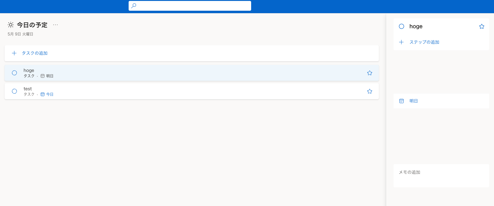
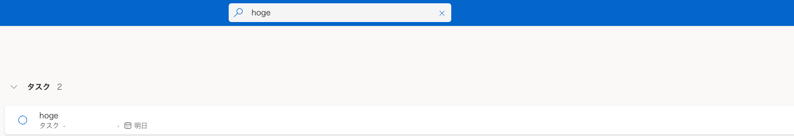

# Subject

[Back to README](/README.md)

[Back to Previous Chapter](/Chap3.md)

研修修了課題として、バックエンド/フロントエンド別にそれぞれ課題を用意しました．

## フロントエンド

下記のReact-v3をpractice1~practice6まで進めましょう

https://github.com/pj100-team/react-v3/issues

※ practiceごとにPR（コードチェック）を上げる必要はありませんが、コードをレビューしてほしい場合は、小寺のアカウント（@HirokiKotera13456）をレビュワーに当てて、PRを上げてからSlackのDMで声をかけてください。またPRでは、mainブランチにはマージしないでください。

## バックエンド

### 技術要件

- API -> FastAPI (poetry管理)
- DB -> お好みのDBを使用してください。sqlite3でも可能

### 内容

</img>

作成してもらうのは上のような簡単なTODOアプリです(APIの部分のみでHTML&CSSは不要)

1. ユーザーはTODOリストを追加/削除することができる。(認証機能は無し)
    1. TODOリストにはタイトルと締切、メモを追加することができる。
    2. TODOリストにはそれぞれ、子タスク(図中ではステップ)を作成することができる。子タスクはその下に子タスクを持つことはできない。子タスクには、名前だけを持たせる。親タスクが削除された場合、子タスクも削除される。
2. すべてのタスクを一括取得することができる。
3. 名前を指定してタスクを取得することができる。
4. TODOリストのデータはDBに保存されている。

</img>

参考にしたのはMicroSoftのTODOリストです。機能を絞ってありますが、もしも動作を確認したい場合は、以下のリンクからアクセスできます。
もしも要件でわからないところがあれば参考にしてください。

https://to-do.live.com/tasks

### 制約

- FastAPIやDjango Rest FrameworkなどChap2で学習したフレームワークを使用して作成すること．
- リンターやフォーマッターを適切に設定すること
- リンターにはflake8、フォーマッターにはblackを使用すること
- なるべくTypeHintが記述されていること
- テストケース/テストコードを作成すること
- テストツールは任意のものを用いてよい
- テスト実行時にエラーが発生しないこと
- ソースコードはGitで管理し、作成したソースコードはGitHubにアップロードすること

## 次のChapterを始める前に

本リポジトリを`clone`して,改善点を見つけて`Pull Request`(以下、PRと省略)を出しましょう！
どんな些細なPRでも構いません！:pray:
改善点の`Pull Request`が出されたら、本Chapterのフィードバックと次Chapterのプランを作成するための面談をセットするので改善点の`Pull Request`はどんな内容でもいいので必ず出してください！

[Go to Next Chapter](/Chap5.md)
